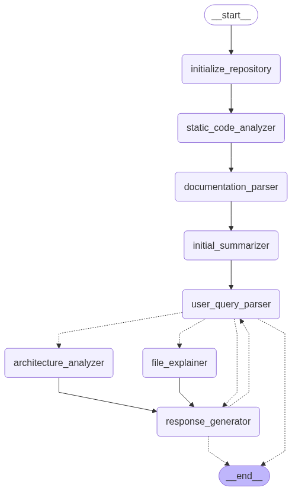

# Repo Explainer Agent

## Description

The Repo Explainer Agent is a tool designed to understand and explain code repositories. It analyzes the repository structure, code, and documentation to provide insights and answer user queries about the codebase.



## How it Works: The Agent's Flow

The Repo Explainer Agent processes a code repository and user queries through a sequence of operations orchestrated by `src/graph.py`. The flow can be broadly divided into initial analysis and query-driven analysis:

**Phase 1: Initial Repository Ingestion & Baseline Analysis**

This phase occurs once when a new repository is introduced.

1.  **Repository Initialization (`initialize_repository_node`):**
    *   Clones the target Git repository (if a URL is provided) or prepares a local path.
    *   Performs essential setup for the analysis.

2.  **Core Content Analysis:**
    *   **Static Code Analysis (`static_code_analyzer_node`):** Parses the source code to identify definitions (classes, functions, etc.), dependencies, and relationships between code components. This builds a structural map of the codebase.
    *   **Documentation Parsing (`documentation_parser_node`):** Extracts information from documentation files (e.g., READMEs, Markdown files) and potentially inline comments to capture explicit developer knowledge.

3.  **Initial High-Level Summarization (`initial_high_level_summarizer_node`):**
    *   Based on the data gathered from static code analysis and documentation parsing, this node generates an initial, high-level overview of the repository's purpose, main components, and general architecture. This summary serves as a baseline understanding.

**Phase 2: User Query Processing & Targeted Analysis**

This phase is triggered when a user submits a query.

4.  **User Query Parsing (`user_query_parser_node`):**
    *   The agent processes the user's natural language question to determine its intent (e.g., "explain this file," "describe the architecture," "what is the purpose of this repo?").

5.  **Conditional Targeted Analysis:**
    *   Based on the parsed query intent, the graph routes the request to the appropriate specialized node(s):
        *   **File-Specific Explanation (`file_explainer_node`):** If the query pertains to a specific file, this node is activated to generate a detailed explanation of that file's role, contents, and connections.
        *   **Architecture Analysis (`architecture_analyzer_node`):** If the user asks about the repository's architecture, this node performs a more in-depth analysis of the codebase's structure, design patterns, and module interactions.
        *   For general overview queries (e.g., "tell me about this repo"), the system may leverage the summary already generated by the `initial_high_level_summarizer_node`.

6.  **Response Generation (`response_generator_node`):**
    *   This final node synthesizes all relevant information—from the initial analysis, the parsed user query, and any targeted analysis performed (like file or architecture explanations)—to construct a coherent and informative answer for the user.

This structured flow, moving from broad initial analysis to specific query-driven deep dives, allows the Repo Explainer Agent to build a comprehensive understanding and provide relevant answers about the codebase.

## Installation

1.  **Clone the repository:**
    ```bash
    git clone https://github.com/your-username/repo_explainer_agent.git
    cd repo_explainer_agent
    ```
2.  **Build the Docker image:**
    ```bash
    docker/build
    ```
    Alternatively, you can build it manually:
    ```bash
    docker build -t repo_explainer_agent .
    ```

## Usage

To run the Repo Explainer Agent, use the provided `docker/run` script or execute the Docker container directly.

**Example:**

To ask a question about a specific repository, you can run:

```bash
docker/run https://github.com/andreimatveyeu/jackmesh.git "Where is the class Port defined?"
```

This command will:
1.  Initialize the `jackmesh` repository.
2.  Analyze its contents.
3.  Attempt to answer the question "Where is the class Port defined?".

## Project Structure

The project is organized into the following main directories:

*   `src/`: Contains the core logic of the agent.
    *   `core/`: Core components like data models, parsers, and state management.
    *   `nodes/`: Different processing nodes responsible for specific tasks (e.g., static code analysis, documentation parsing).
    *   `utils/`: Utility functions used across the project.
    *   `graph.py`: Manages the graph representation of the repository and the flow of information between nodes.
*   `docker/`: Contains Docker-related files for building and running the agent in a containerized environment.
    *   `Dockerfile`: Defines the Docker image.
    *   `build`: Script to build the Docker image.
    *   `run`: Script to run the Docker container with specified arguments.

## License

This project is licensed under the MIT License - see the [LICENSE](LICENSE) file for details.
